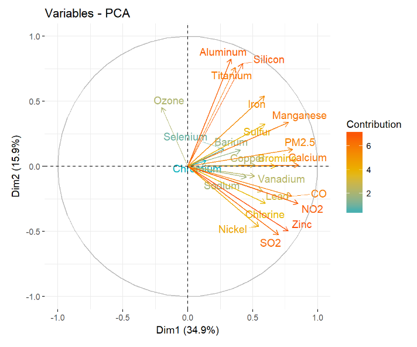

## Introduction 

The World Health Organization has placed air pollution as the world’s largest environmental health risk factor. Air pollution is a leading environmental threat to the health of urban populations overall. Although clean air laws and regulations have improved the air quality in New York and most other large cities, several pollutants in the city’s air are at levels that are harmful. In the present study, we assessed the potential association between exposure to high levels of air pollution and risk for hospitalizations due to respiratory diseases in New York City for the year 2015. We leveraged data from the New York Statewide Planning and Research Cooperative System (SPARCS) and the Environmental Protection Agency’s Air Quality System (AQS) database. 

### Air Pollution

We obtained air pollution data from the US EPA Air Quality (AQS) database, which has been extensively used in previous health studies. The AQS includes data summarized on a daily basis for criteria gases, federal reference method particulates (PM 10 and PM 2.5), meteorological variables, toxicants, ozone precursors, and lead. In this analysis, specifically, we obtained daily data for total PM 2.5 mass concentrations, criteria gases (ozone, nitrogen dioxide (NO2), sulfur dioxide (SO2), and carbon monoxide(CO)) along with the following PM species (individual component particles of PM 2.5): aluminum, selenium, calcium, iron, silicon, lead, manganese, zinc, bromine, copper, nickel, sulfur, titanium, sodium, barium, chlorine, and vanadium. PM 2.5 species were chosen based on a previous study, [Kioumourtzoglou et al. 2014](https://www.nature.com/articles/jes20147#supplementary-information). The ten AQS monitor stations in New York City are depicted in Figure 1 below.

**Figure 1. AQS Monitor Stations in NYC Map**

  

{width=60%}

  

### Health Outcome

The health outcome of interest is the number of hospitalizations due to respiratory disease. This count data follows a Poisson or Quasi-Poisson distribution. The New York Department of Health Statewide Planning and Research Cooperative System (SPARCS) is a comprehensive data reporting system that collects information on hospital admissions and emergency department (ED) visits within New York State. The SPARCS dataset contains information on approximately 98% of all hospitalizations in non-federal acute care facilities regardless of insurance status. Information on patient characteristics, diagnoses, treatments, services, and charges is also collected for each hospitalization or ED visit. Additionally, the dataset includes demographic information such as age, sex, race, and residential address. A unique patient ID is assigned to each person in order to allow for tracking hospitalizations or ED visits over time. We will use SPARCS data on hospital admissions and ED visits from the year 2015 to determine the number of respiratory disease hospitalizations in New York City. Our data is de-identified and consists of counts of inpatient hospitalizations or ED visits per day in the five New York City boroughs: Brooklyn, the Bronx, Manhattan, Staten Island, and Queens.

### Confounders

The unit of analysis in this example is day, thus confounders can only be variables that vary from day to day and covary with both exposure and outcome. Weather conditions influence air pollution levels by concentrating, diluting, or chemically processing pollutants; therefore, we will include temperature as a covariate in our analysis. Data for the temperature variable was also obtained from the AQS database (see description above).

### Research Question

Through this study we aim to answer the question of whether exposure to high levels of air pollution increases the number of respiratory disease hospitalizations in New York City. For this, we will use a combination of supervised and unsupervised data analyses including lasso, boosted random forest, and principal component analysis. 

### Data Preparation

Exposure data were downloaded from the EPA AQS [website](https://aqs.epa.gov/aqsweb/airdata/download_files.html#Raw). We downloaded separate datasets for each criteria gas, PM 2.5, PM species, and temperature. Next, the data was cleaned using the `rTidy` philosophy to obtain a dataset with days as rows and corresponding pollutants as columns. As the PM speciation filters are expensive to analyze, they are only measured every three days. Thus, we restricted our analyses to every third day of 2015 when we had complete data (n = 108). We obtained the outcome data from SPARCS from a colleague. It includes counts of inpatient hospital or ED visits per day in NYC. As this data is de-identified, this analysis was exempt from IRB oversight. Exposure and outcome datasets were merged for final analyses. We created separate training and testing datasets to ensure rigor and reproducibility in our analyses.

The code for data preparation and cleaning can be found in our [GitHub repository](https://github.com/lizzyagibson/Air.Pollution.Health).

## Unsupervised Analysis

### Exploratory Data Analysis

In the exploratory data analysis (EDA), the first boxplot (Figure 2a) of the PM 2.5 species shows that by a large difference, sulfur is the pollutant with the highest concentration (and standard deviation). The second boxplot (Figure 2b) of criteria gas and particulate concentrations shows that NO2 has a larger concentration than all of the PM 2.5 species combined. 

**Figure 2. (a) PM 2.5 Species and (b) Criteria Gases**

  

{width=48%} {width=48%} 

  

### Principal Component Analysis

For the unsupervised analysis, we also used a Principal Component Analysis (PCA). This is a low-dimensional representation of the data that captures as much of the information as possible, to which each of the n observations exists in a p-dimensional space. PCA seeks a small number of dimensions that are all as "interesting" as possible (not all dimensions are equally interesting), which is measured by the amount that the observations vary along each dimension. Each of the dimensions found by PCA is a linear combination of the p features. The first two principal components of a dataset span the plane that is closest to the n observations in terms of average squared Euclidean distance. PCA requires strong assumptions, including multiple continuous variables, a linear relationship between all variables, a large enough sample size, and no significant outliers (as PCA is very susceptible to outliers). We chose PCA because the dataset contains a large amount of correlated variables, and PCA will help to understand which variables comprise a majority of the variability in the data. The model fit was first assessed using Figures 3 and 4 shown below.

**Figure 3. Assessing Model Fit Using Scree Plot**

  

{width=60%}

  

**Figure 4. Assessing Model Fit Using Variance Plot**

  

{width=60%}

  

The scree plot reveals that about ~35% of the variance in the data was captured in the first principal component (PC1). The remaining 65% of the variance was captured by nine other PCs. 

**Figure 5. Heat Map of PCA Data**

  

{width=60%} 

  

As shown in Figure 5, a heat map of the data reveals that PC1, which comprises most of the variability in the dataset, contains three out of four of the criteria air pollutants (NO2, CO, and SO2) and PM 2.5. The fourth criteria air pollutant, ozone, was not in PC1 but did appear in the other PC's to varying extents. In fact, the plot of the eigenvectors (below) shows that ozone is in a different dimensional space compared to all of the other variables in the dataset. NO2, CO, and SO2 are in a similar dimensional space, and PM 2.5 is more similar to those three criteria air pollutants, but is also in a different dimensional space. 

**Figure 6. Eigenvectors**

  

{width=60%} 

  

**Figure 7. Loadings**

  

{width=60%} 

  

In comparing week days and weekends, there is a bit of overlap in the PCA. In comparing days in different seasons, winter has a strongly different distribution of pollutants compared with fall, spring, and summer.

**Figure 8. PCA (a) Weekly and (b) Seasonal Plots**

  

{width=48%} {width=48%}

  

## Supervised Analysis

**What predictor variables did you include?**

All of the predictor variables from the cleaned dataset were used except for day of the week, humidity and date. 

**What technique did you use, and why did you choose it? What assumptions, if any, are being made by using this technique?**

For our supervised analyses we used boosted random forests and lasso. 

### Boosted Random Forests

Boosted random forests can help in classifying variables, similar to that of regression trees but in a much more stable manner and without assumptions on any information regarding the distribution or collinearity of variables in the model. In boosted random forests, there are three tuning parameters: the number of trees, the amount of shrinkage, and the number of splits in each tree (depth). The number of trees was selected by comparing various values. With 100 iterations (left), both the test set and training set MSEs were large (3201.43 and 3086.71, respectively), but 12 variables were removed. On the other hand, 5000 iterations resulted in smaller MSEs but none of the variables were excluded. Thus, 1000 iterations (right) were chosen because this boosted random forest resulted in smaller training and test set MSEs (2552.90 and 2674.02, respectively), as well as removed four variables. The shrinkage value is a measure of the learning rate and 0.001 is a recommended value for growing a lot of trees using a small dataset. Lastly, as this is an additive model, the depth was set to 1.

In assessing the model fit, a comparison of the true test value with the predicted test values and corresponding deviance scores was completed. Table 1 below shows the first six value comparisons:

**Table 1. Boosted Random Forest True and Predicted Values from 100 vs 1000 Iterations with Corresponding Deviance Scores**

  

{width=70%} 

  

**Figure 9. Boosted Random Forest Relative Influence of Variables (a) 100 vs (b) 1000 Iterations**

  

{width=48%} {width=48%}

  

The plots above reveal that ozone has the highest relative influence on respiratory hospital admissions and ED visits, regardless of the number of iterations. The table below shows other variables of interest that may also play a role:

**Table 2. Boosted Random Forest Relative Influence Values for 1000 Iterations**

  

{width=40%}

  

### Lasso

For one of our supervised analyses we use lasso. The predictor variables we use in this analysis are: total PM 2.5 mass concentrations, ozone, sulfate, nitrate, aluminum, calcium, iron, silicon, lead, manganese, zinc, bromine, copper, nickel, sulfur, vanadium and temperature. Lasso is a variable selection method that yields sparse models, that is, models that are easier to interpret in comparison to ridge regression. This is due to the fact that depending on the choice of the lambda parameter (Figure 10), some of the coefficients will be exactly equal to zero which helps produce a more simplify model. It is also important to mention that lasso relies on a linear model and assumes noncorrelation between the variables. 

**Figure 10. Lambda Values**

  

{width=65%}

  

For the analysis we split the data into a train and test dataset. We use the train dataset to fit the lasso model and find the best lambda value using cross-validation. Then use the test dataset to test the performance of our model. 

**Results** 

The best lambda value that we found through cross-validation is 4.479. In Figure 11, we can also see that when testing multiple data values in the train dataset, the lambda value that produces the lower mean square error (MSE) is around 4. The lasso model with the lambda chosen by cross-validation contains only 10 variables which are presented in Table 3. 

The MSE from the prediction using the train dataset is 2177.17 and the MSE using the test dataset is 6587.115.

**Figure 11. Best Lambda Value**

  

{width=65%}

  

**Table 3. Lasso Variable Coefficients**

  

{width=40%}

  

**Table 4. Boosted Random Forest and Lasso Test MSEs**

  

{width=40%}

  

As shown in Table 4, a comparison of the boosted and lasso test MSE's resulted in the lasso with a suprisingly higher test set MSE. 

## Conclusion

**How did you make your predictions?**

**Can you explain anything about the nature of the relationship between the predictors in your model and the predictions themselves?**

**What were your findings? Are they what you expect? What insights into the data can you make?**

